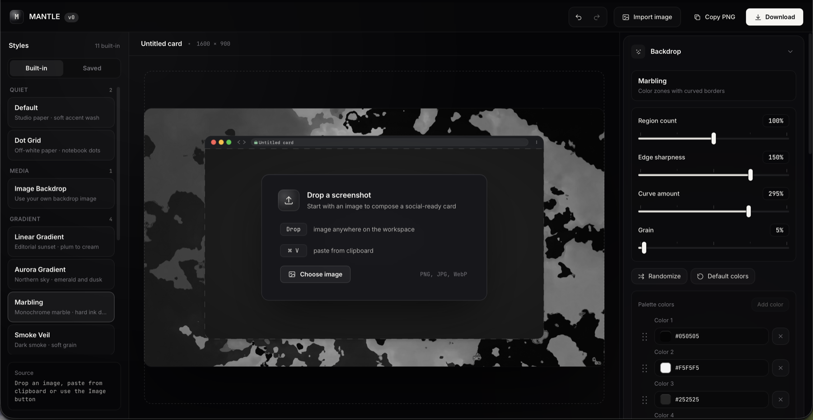

# Mantle

Mantle is a browser-first image composer for builders, founders, and content creators.

Import a screenshot or image, choose a visual system, tune the frame, background, text, and export settings, then copy or download a polished visual for social posts, launches, app stores, docs, or product updates.

Live app: [mantle.kegashin.me](https://mantle.kegashin.me)

> Status: early v0. Mantle is usable, but project files, preset files, and internal package APIs may still change.



## Features

- Drag, paste, or pick PNG, JPEG, and WebP source images.
- Compose visuals for social posts, launch assets, app stores, docs, and product updates.
- Built-in styles for solid color, gradients, marbling, smoke, glyph fields, scanlines, contour lines, and dot grids.
- Optional custom backdrop images.
- Browser, macOS, Windows, terminal, code editor, document, and frameless presentations.
- Solid and glass frame surfaces with spacing, corner, shadow, and chrome controls.
- Non-destructive stage editing for image placement, frame placement, text placement, scale, crop, and rotation.
- Optional title and subtitle text around the screenshot.
- Saved style presets stored in the browser, with JSON import and export.
- PNG, JPEG, and WebP downloads.
- PNG copy-to-clipboard when the browser allows image clipboard writes.
- Canvas-based preview and export through the same rendering pipeline.

## Privacy Model

Mantle does not include an upload backend or analytics code.

Images are loaded in the browser as local `File`, `Blob`, and object URL data. Export happens client-side. Saved styles are stored in browser storage. If you deploy Mantle behind your own analytics, proxy, or hosting layer, that layer is separate from this repository.

Project JSON files intentionally store image metadata, not the original image bytes. If you reopen a saved project later, relink the local source image before exporting.

## Browser Support

Mantle targets modern desktop browsers. Small screens and touch-first devices show a desktop-only notice instead of the editor.

Chromium-based browsers currently provide the smoothest image clipboard support. Safari and Firefox can use the editor and download exports, but image clipboard writes or some newer image codecs may be blocked by browser policy. Use Download when Copy PNG is unavailable.

## Run Locally

Requirements:

- Bun 1.3.7 or newer

Install dependencies:

```sh
bun install
```

Run the local app:

```sh
bun run dev
```

Build for production:

```sh
bun run build
```

Preview the production build:

```sh
bun run preview
```

## Tech Stack

- TypeScript
- React 19
- Vite 7
- Bun workspaces
- Canvas-based composition renderer
- Vitest and Playwright

## Scripts

| Command | Description |
| --- | --- |
| `bun run dev` | Start the Vite dev server for the web app. |
| `bun run build` | Build packages and the web app. |
| `bun run preview` | Preview the production web build locally. |
| `bun run typecheck` | Typecheck tooling, packages, and the web app. |
| `bun run test:unit` | Run Vitest unit tests. |
| `bun run test:e2e` | Run Playwright end-to-end tests. |
| `bun run check:architecture` | Check package boundary rules. |

## Project Structure

```text
apps/
  web/          React + Vite editor UI
packages/
  engine/       Canvas composition, preview, export, and render commands
  schemas/      Serializable Mantle project, card, preset, and export contracts
scripts/        Repository maintenance scripts
```

The public app is `apps/web`. The internal packages keep rendering and schema logic out of React so the browser UI, preview worker, export path, and future automation surfaces can share the same model.

## Contributing

Issues and pull requests are welcome while the project is early. Please keep changes focused, user-facing copy in English, and avoid adding telemetry, analytics, or networked services without discussion.

Before opening a pull request, run:

```sh
bun run typecheck
bun run test:unit
```

## License

Apache-2.0. See [LICENSE](./LICENSE).
